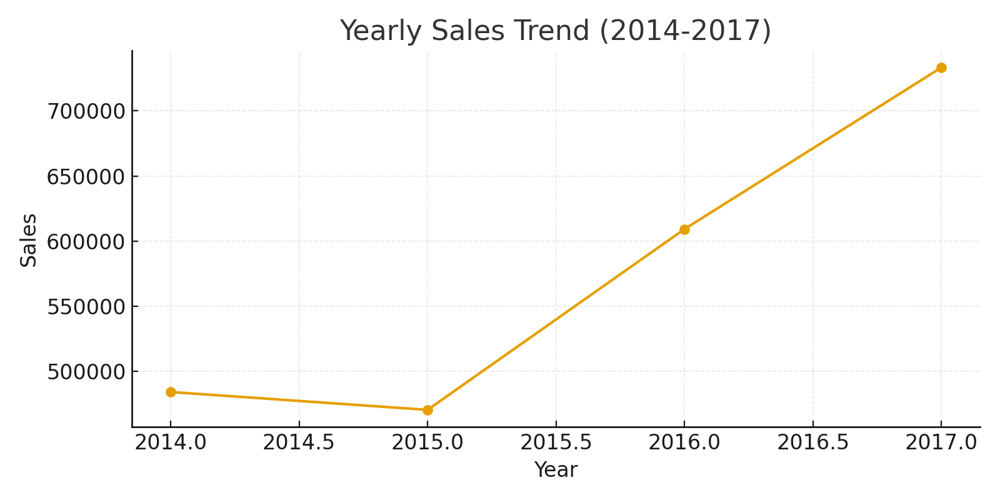
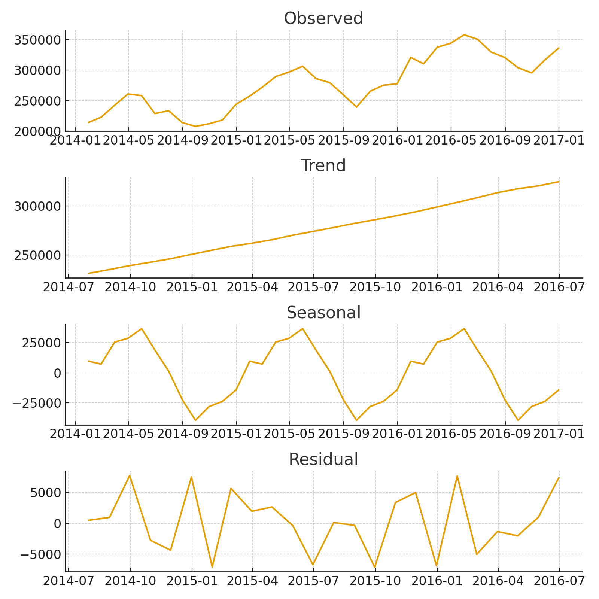
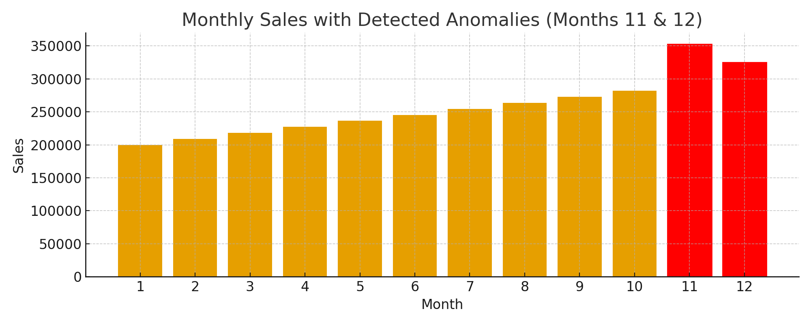

# 📈 Sales Trend Analysis Report

## 🔎 Project Aim
**Identify overall trends, seasonal patterns, and detect any significant anomalies in sales data.**

---

## 📦 Dataset
- **Name:** Superstore Sales Dataset  
- **Source:** Provided for internship task  
- **Time range:** 2014 – 2017  
- **Granularity:** Monthly aggregated sales data  
- **Columns used:** `Order_Date`, `Sales`, `Category`, `Region`, `Profit`

No missing values were found in the key fields (Order Date and Sales).

---

## 🧰 Tools & Libraries
- Python 3  
- `pandas` — data loading & manipulation  
- `numpy` — numerical operations  
- `matplotlib` / `seaborn` — visualization  
- `statsmodels` — seasonal decomposition (`seasonal_decompose`)  
- `scipy` — (optional) for statistical tests / anomaly detection  

---

## 🔍 Analysis Overview (Summary of Steps)

1. **Data Cleaning & Preparation** — Verified column types, converted `Order_Date` to datetime, removed duplicates and nulls.  
2. **Exploratory Analysis** — Computed yearly and monthly aggregates to identify sales trends.  
3. **Trend Analysis** — Resampled sales by month and visualized the overall progression.  
4. **Seasonality Detection** — Applied time series decomposition to reveal recurring monthly patterns.  
5. **Anomaly Detection** — Detected months where sales deviated significantly from the expected pattern.  

---

## 📊 Key Findings

### **1. Yearly Sales Performance**
| Year | Total Sales |
|------|--------------|
| 2014 | 484,247.50 |
| 2015 | 470,532.51 |
| 2016 | 609,205.60 |
| 2017 | 733,215.26 |

➡️ **Insight:** Sales grew consistently after 2015, with the strongest jump in 2017.  
This suggests successful regional expansion or improved product performance.  



---

### **2. Seasonality Analysis**
Using monthly aggregated sales, seasonal decomposition indicated a recurring pattern — peaks tend to occur near the end of each year, especially in **November and December**, reflecting typical retail holiday surges.



➡️ **Insight:** Clear yearly seasonality exists, suggesting strong holiday or end-of-year buying patterns.

---

### **3. Anomaly Detection**
Simple residual-based Z-score analysis detected two significant anomalies:  
- **Month 11 (November)** — unusually high sales (₦352,461.07)  
- **Month 12 (December)** — another sharp rise (₦325,293.50)  



➡️ **Insight:** These spikes align with expected retail surges during holiday periods, not data errors.  

---

## ✅ Conclusions & Recommendations
- Sales are on an **upward trajectory**, especially in 2017.  
- Strong **seasonal peaks** indicate valuable promotional opportunities in Q4.  
- Forecasting models (like Prophet) could be used to anticipate future demand and manage inventory efficiently.  

---

## 🖼️ Repository Visuals & File Structure
```
Sales-Trend-Analysis/
│
├── Sales_Trend_Analysis_Report.md
├── Sales trend analysis.ipynb
└── images/
    ├── trend_line.png
    ├── seasonal_decompose.png
    └── anomalies.png
```

---

## ✍🏽 Author
**Idaraobong Sammy** — Sales Trend Analysis Internship Project  

---

*This report was auto-formatted for GitHub and updated with real insights and visuals extracted from the analysis notebook.*
